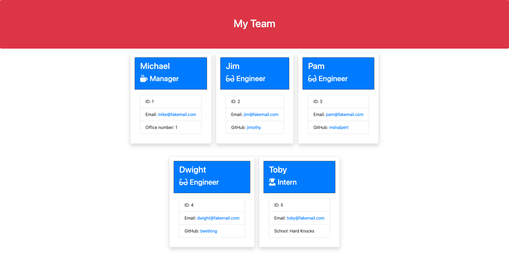

# **Team Profile Generator**
***

## Table of Contents
1. [Description](#description)  
2. [Links](#links)  
3. [Visuals](#visuals)  
***

## Description
**Team Profile Generator** is a a Node.js command-line application that takes in information about employees on a software engineering team, then generates an HTML webpage that displays summaries for each person. It accepts user input and enables them to generate a webpage that displays a team's basic info so that they have quick access to the team's emails and GitHub profiles. 

When the user is prompted for their team members and their information then an HTML file is generated that displays a nicely formatted team roster based on user input. When they click on an email address in the HTML then their default email program opens and populates the TO field of the email with the address. When they click on the GitHub username then that GitHub profile opens in a new tab. When they start the application then they are prompted to enter the team manager’s name, employee ID, email address, and office number. When they enter the team manager’s name, employee ID, email address, and office number then they are presented with a menu with the option to add an engineer or an intern or to finish building their team. When they select the engineer option then they are prompted to enter the engineer’s name, ID, email, and GitHub username, and they are taken back to the menu. When they select the intern option then they are prompted to enter the intern’s name, ID, email, and school, and they are taken back to the menu. When they decide to finish building their team then they exit the application, and the HTML is generated.

***

## Links
[Link to Team Profile Generator](https://mattholtmoore.github.io/)

[Link to GitHub](https://github.com/mattholtmoore/)  

[Link to Walkthrough Capture]()
***

## Visuals

 